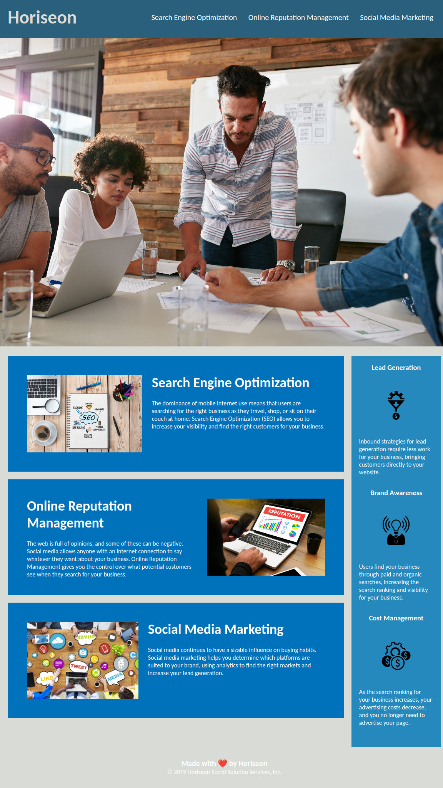

# <Your-Project-Title>

## Description

Refactored code for Horiseon to follow accessibility standards by moving to using semantic HTML. The CSS was optimized by consolidating and removing duplicate code. Cleaned up some HTML code by removing incorrect code (</img> and '/'>) in the img tags.

## Installation

N/A

## Usage

Landing page for Horiseon Social Solutions Services, Inc.

https://josht-dev.github.io/wk1c-marketing-accessibility-refactor/

## Credits

Original code provided by client here: https://github.com/coding-boot-camp/urban-octo-telegram

## License

Refer to the LICENSE in the repo.
